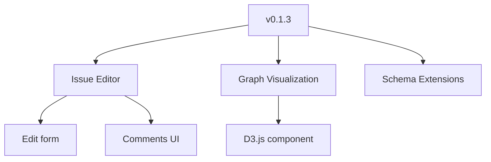

# Architecture: MGraph-DB Integration for Graph-Based Issue Tracking

**Version:** Draft v0.1
**Date:** 2026-02-01
**Author:** Architecture Planning Session
**Status:** Proposal for Review

---

## Executive Summary

### The Problem

The current file-based issue tracking system works well but has a **fundamental scalability limitation**: to see all relationships between nodes, we must open every file.

```
┌─────────────────────────────────────────────────────────────────────────────────┐
│                         CURRENT ARCHITECTURE (Scalability Problem)               │
├─────────────────────────────────────────────────────────────────────────────────┤
│                                                                                  │
│   Question: "What issues are linked to Feature-11?"                             │
│                                                                                  │
│   ┌─────────────┐                                                               │
│   │   API       │                                                               │
│   │   Request   │                                                               │
│   └──────┬──────┘                                                               │
│          │                                                                       │
│          ▼                                                                       │
│   ┌─────────────────────────────────────────────────────────────────────────┐   │
│   │                         MUST SCAN ALL FILES                              │   │
│   │                                                                          │   │
│   │  .issues/data/                                                           │   │
│   │  ├── bug/                                                                │   │
│   │  │   ├── Bug-1/node.json     ◄── Open & parse                           │   │
│   │  │   ├── Bug-2/node.json     ◄── Open & parse                           │   │
│   │  │   └── Bug-3/node.json     ◄── Open & parse                           │   │
│   │  ├── task/                                                               │   │
│   │  │   ├── Task-1/node.json    ◄── Open & parse                           │   │
│   │  │   ├── Task-2/node.json    ◄── Open & parse                           │   │
│   │  │   ├── Task-3/node.json    ◄── Open & parse                           │   │
│   │  │   └── ... (N more)        ◄── Open & parse ALL                       │   │
│   │  ├── feature/                                                            │   │
│   │  │   └── ... (all files)     ◄── Open & parse ALL                       │   │
│   │  └── version/                                                            │   │
│   │      └── ... (all files)     ◄── Open & parse ALL                       │   │
│   │                                                                          │   │
│   │  Complexity: O(N) where N = total number of issues                       │   │
│   │  With 10,000 issues = 10,000 file reads for ONE query!                   │   │
│   │                                                                          │   │
│   └─────────────────────────────────────────────────────────────────────────┘   │
│                                                                                  │
└─────────────────────────────────────────────────────────────────────────────────┘
```

### The Solution

Use **MGraph-DB as a hierarchical indexing layer** that provides O(1) relationship lookups while keeping files as the source of truth.

```
┌─────────────────────────────────────────────────────────────────────────────────┐
│                      PROPOSED ARCHITECTURE (MGraph-DB Indexes)                   │
├─────────────────────────────────────────────────────────────────────────────────┤
│                                                                                  │
│   Question: "What issues are linked to Feature-11?"                             │
│                                                                                  │
│   ┌─────────────┐                                                               │
│   │   API       │                                                               │
│   │   Request   │                                                               │
│   └──────┬──────┘                                                               │
│          │                                                                       │
│          ▼                                                                       │
│   ┌─────────────────────────────────────────────────────────────────────────┐   │
│   │                     QUERY MGRAPH-DB INDEX                                │   │
│   │                                                                          │   │
│   │  index.edges_index.edges_from_node(feature_11_node_id)                  │   │
│   │                                                                          │   │
│   │  Result: [Task-2, Task-3, Task-4, UserStory-1]                          │   │
│   │                                                                          │   │
│   │  Complexity: O(1) hash lookup + O(K) where K = number of links          │   │
│   │                                                                          │   │
│   └─────────────────────────────────────────────────────────────────────────┘   │
│          │                                                                       │
│          │ (Only if full node data needed)                                      │
│          ▼                                                                       │
│   ┌─────────────────────────────────────────────────────────────────────────┐   │
│   │                     FETCH SPECIFIC FILES                                 │   │
│   │                                                                          │   │
│   │  Only open the 4 files we actually need:                                │   │
│   │  • .issues/data/task/Task-2/node.json                                   │   │
│   │  • .issues/data/task/Task-3/node.json                                   │   │
│   │  • .issues/data/task/Task-4/node.json                                   │   │
│   │  • .issues/data/user-story/UserStory-1/node.json                        │   │
│   │                                                                          │   │
│   └─────────────────────────────────────────────────────────────────────────┘   │
│                                                                                  │
└─────────────────────────────────────────────────────────────────────────────────┘
```

---

## The Hierarchical MGraph-DB Model

### Core Insight

The `.issues/` folder already has a hierarchical structure:

```
.issues/
├── config/                          ◄── Configuration (node-types, link-types)
└── data/
    ├── _global_index.json           ◄── Global statistics
    ├── bug/                         ◄── One folder per node type
    │   ├── _index.json
    │   ├── Bug-1/node.json
    │   └── Bug-2/node.json
    ├── task/
    │   ├── _index.json
    │   ├── Task-1/node.json
    │   ├── Task-2/node.json
    │   └── ...
    ├── feature/
    ├── version/
    └── user-story/
```

**Proposal:** Mirror this hierarchy with MGraph-DB instances:

```
.issues/
├── _mgraph.db                       ◄── ROOT MGraph: indexes ALL issues
└── data/
    ├── bug/
    │   ├── _mgraph.db               ◄── TYPE MGraph: indexes all bugs
    │   ├── Bug-1/node.json
    │   └── Bug-2/node.json
    ├── task/
    │   ├── _mgraph.db               ◄── TYPE MGraph: indexes all tasks
    │   ├── Task-1/node.json
    │   └── ...
    ├── feature/
    │   ├── _mgraph.db               ◄── TYPE MGraph: indexes all features
    │   └── ...
    └── version/
        ├── _mgraph.db               ◄── TYPE MGraph: indexes all versions
        └── ...
```

### The Three-Tier Index Architecture

```
┌─────────────────────────────────────────────────────────────────────────────────┐
│                      THREE-TIER MGRAPH-DB INDEX HIERARCHY                        │
├─────────────────────────────────────────────────────────────────────────────────┤
│                                                                                  │
│   TIER 1: ROOT INDEX                                                            │
│   ────────────────────                                                          │
│   Location: .issues/_mgraph.db                                                  │
│   Contains: All nodes (summary), ALL edges (complete)                           │
│   Purpose: Cross-type queries, full relationship graph                          │
│                                                                                  │
│   ┌─────────────────────────────────────────────────────────────────────────┐   │
│   │                         ROOT MGRAPH                                      │   │
│   │                                                                          │   │
│   │  NODES (Summary Only):                    EDGES (Complete):             │   │
│   │  ┌────────────────────┐                  ┌────────────────────┐         │   │
│   │  │ Bug-1:             │                  │ Feature-11 ──────┐ │         │   │
│   │  │   label, type,     │                  │   │has-task     │ │         │   │
│   │  │   status, title    │                  │   ▼              ▼ │         │   │
│   │  ├────────────────────┤                  │ Task-2        Task-3│         │   │
│   │  │ Task-2:            │                  │                    │         │   │
│   │  │   label, type,     │                  │ Version-1 ────────┐│         │   │
│   │  │   status, title    │                  │   │has-feature   ││         │   │
│   │  ├────────────────────┤                  │   ▼              ▼│         │   │
│   │  │ Feature-11:        │                  │ Feature-11  Feature-12       │   │
│   │  │   label, type,     │                  └────────────────────┘         │   │
│   │  │   status, title    │                                                 │   │
│   │  └────────────────────┘                                                 │   │
│   │                                                                          │   │
│   │  Query: "All nodes linked to Feature-11" → O(1)                         │   │
│   │  Query: "All tasks blocked by bugs" → O(1)                              │   │
│   │                                                                          │   │
│   └─────────────────────────────────────────────────────────────────────────┘   │
│          │                                                                       │
│          │ References                                                           │
│          ▼                                                                       │
│   TIER 2: TYPE INDEXES                                                          │
│   ────────────────────                                                          │
│   Location: .issues/data/{type}/_mgraph.db                                      │
│   Contains: All nodes of that type (full detail), internal edges                │
│   Purpose: Type-specific queries, filtering within type                         │
│                                                                                  │
│   ┌──────────────────┐  ┌──────────────────┐  ┌──────────────────┐             │
│   │  task/_mgraph.db │  │  bug/_mgraph.db  │  │feature/_mgraph.db│             │
│   │                  │  │                  │  │                  │             │
│   │  Task-1 (full)   │  │  Bug-1 (full)    │  │ Feature-11 (full)│             │
│   │  Task-2 (full)   │  │  Bug-2 (full)    │  │ Feature-12 (full)│             │
│   │  Task-3 (full)   │  │  Bug-3 (full)    │  │ Feature-13 (full)│             │
│   │  ...             │  │  ...             │  │ ...              │             │
│   │                  │  │                  │  │                  │             │
│   │  + task→task     │  │  + bug→bug       │  │  + feature→feat  │             │
│   │    edges         │  │    edges         │  │    edges         │             │
│   └──────────────────┘  └──────────────────┘  └──────────────────┘             │
│          │                      │                      │                        │
│          │ References           │ References           │ References             │
│          ▼                      ▼                      ▼                        │
│   TIER 3: FILE STORAGE (Source of Truth)                                        │
│   ──────────────────────────────────────                                        │
│   Location: .issues/data/{type}/{Label}/node.json                               │
│   Contains: Complete node data                                                  │
│   Purpose: Persistence, version control, human-readable                         │
│                                                                                  │
│   ┌──────────────────┐  ┌──────────────────┐  ┌──────────────────┐             │
│   │ Task-2/node.json │  │ Bug-1/node.json  │  │Feature-11/node.json            │
│   │                  │  │                  │  │                  │             │
│   │ { full JSON }    │  │ { full JSON }    │  │ { full JSON }    │             │
│   │                  │  │                  │  │                  │             │
│   └──────────────────┘  └──────────────────┘  └──────────────────┘             │
│                                                                                  │
└─────────────────────────────────────────────────────────────────────────────────┘
```

---

## Data Distribution Strategy

### The Key Question

> "Do we have data loss as you go up the hierarchy, or do we get enough clues to find what we need?"

### Proposed Solution: "Summary + Full Edges"

```
┌─────────────────────────────────────────────────────────────────────────────────┐
│                         DATA AT EACH TIER                                        │
├─────────────────────────────────────────────────────────────────────────────────┤
│                                                                                  │
│   ROOT MGRAPH (Tier 1)                                                          │
│   ─────────────────────                                                         │
│   Node data:  SUMMARY ONLY                                                      │
│               • node_id                                                         │
│               • label (Bug-1, Task-2, etc.)                                     │
│               • node_type                                                       │
│               • status                                                          │
│               • title                                                           │
│                                                                                  │
│   Edge data:  COMPLETE                                                          │
│               • All relationships                                               │
│               • edge_id, from_node_id, to_node_id                              │
│               • link_type (verb: has-task, blocks, etc.)                       │
│                                                                                  │
│   Why: Edges are the "glue" - we need ALL of them to answer                    │
│        relationship queries. Node summaries give enough context                 │
│        to filter/display without fetching full files.                          │
│                                                                                  │
│   TYPE MGRAPH (Tier 2)                                                          │
│   ─────────────────────                                                         │
│   Node data:  FULL DETAIL                                                       │
│               • Everything from node.json                                       │
│               • description, tags, properties, comments                         │
│                                                                                  │
│   Edge data:  INTERNAL ONLY                                                     │
│               • Only edges between nodes of this type                          │
│               • task→task, feature→feature                                     │
│                                                                                  │
│   Why: Full detail allows type-specific filtering without                      │
│        hitting files. Cross-type edges are in ROOT.                            │
│                                                                                  │
│   FILE STORAGE (Tier 3)                                                         │
│   ─────────────────────                                                         │
│   Node data:  COMPLETE + AUTHORITATIVE                                          │
│               • The source of truth                                             │
│               • Human-readable, git-versioned                                   │
│                                                                                  │
│   Edge data:  EMBEDDED IN NODE                                                  │
│               • node.links[] array                                              │
│                                                                                  │
└─────────────────────────────────────────────────────────────────────────────────┘
```

---

## MGraph-DB Node Mapping

### Schema Naming Convention

**Important:** All schemas for this integration use the prefix `Schema__Issue__MGraph__*` to prevent naming conflicts:

```
Schema__Issue__MGraph__Node           # Issue node for MGraph storage
Schema__Issue__MGraph__Node__Data     # Node data structure
Schema__Issue__MGraph__Edge           # Issue link as MGraph edge
Schema__Issue__MGraph__Edge__Data     # Edge data structure
Schema__Issue__MGraph__Graph          # The issue graph itself
```

This prevents confusion like "what does Schema__Issue__Node refer to?" — it's clearly the *original* file-based schema, while `Schema__Issue__MGraph__Node` is the MGraph-specific version.

### Custom Node/Edge Data Classes (Type_Safe)

A key power of MGraph-DB is supporting **custom node and edge data classes**. We leverage this fully:

```python
# ═══════════════════════════════════════════════════════════════════════════════
# Custom Node Data - Type_Safe, NOT raw Python primitives
# ═══════════════════════════════════════════════════════════════════════════════

class Schema__Issue__MGraph__Node__Data(Schema__MGraph__Node__Data):
    """Custom node data for issue tracking nodes."""
    label      : Safe_Str__Node_Label                                    # Bug-1, Task-3
    issue_type : Safe_Str__Node_Type                                     # bug, task, feature
    status     : Safe_Str__Status                                        # todo, in-progress
    title      : Safe_Str__Text                                          # Issue title
    created_at : Timestamp_Now                                           # Creation timestamp
    updated_at : Timestamp_Now                                           # Last update timestamp
    
    # For TYPE-level indexes (full detail)
    description : Safe_Str__Issue__Node__Description = None              # Optional in summary
    tags        : List__Issue__Tags                  = None              # Type_Safe collection
    properties  : Dict__Issue__Properties            = None              # Type_Safe dict


class Schema__Issue__MGraph__Edge__Data(Schema__MGraph__Edge__Data):
    """Custom edge data for issue links."""
    link_type_id : Obj_Id                                                # Reference to link-types.json
    verb         : Safe_Str__Link_Verb                                   # has-task, blocks, etc.
    created_at   : Timestamp_Now                                         # When link was created
```

**Why Type_Safe, not raw primitives?**

```python
# ✗ WRONG - Raw Python primitives lose type safety
class Bad__Node__Data(Type_Safe):
    label  : str                      # No validation!
    status : str                      # Could be anything!
    tags   : list                     # List of what? No enforcement!

# ✓ CORRECT - Type_Safe primitives with validation
class Schema__Issue__MGraph__Node__Data(Type_Safe):
    label  : Safe_Str__Node_Label     # Validates ^[A-Z][a-zA-Z]*-\d+$
    status : Safe_Str__Status         # Validates against allowed statuses
    tags   : List__Issue__Tags        # Type_Safe__List with element validation
```

Benefits:
- **Runtime validation**: Bad data caught immediately at assignment
- **Self-documenting**: Type names describe constraints
- **JSON serialization**: Automatic, type-preserving
- **Consistency**: Same validation everywhere

### Type_Safe Collections for Issue Data

```python
# Custom collection types for issue data
class List__Issue__Tags(Type_Safe__List):                                # Tags collection
    expected_type = Safe_Str__Tag

class Dict__Issue__Properties(Type_Safe__Dict):                          # Properties dict
    expected_key_type   = Safe_Str__Key
    expected_value_type = object                                         # Flexible values

class List__Issue__Comments(Type_Safe__List):                            # Comments collection
    expected_type = Schema__Issue__Comment

class Dict__Issue__Nodes__By_Label(Type_Safe__Dict):                     # Node index by label
    expected_key_type   = Safe_Str__Node_Label
    expected_value_type = Schema__Issue__MGraph__Node
```

### Issue Node → MGraph Node

```python
# Current Issue Node (from node.json)
{
    "node_id": "f030a103",
    "node_type": "task",
    "node_index": 3,
    "label": "Task-3",
    "title": "Add comments section",
    "description": "Implement comments...",
    "status": "todo",
    "created_at": 1769965000000,
    "updated_at": 1769972288859,
    "created_by": "dc000001",
    "tags": ["ui", "component"],
    "links": [...],
    "properties": {...}
}

# Maps to MGraph Node
Schema__MGraph__Node:
    node_id   : Node_Id("f030a103")
    node_path : Node_Path("task.Task-3")           # Hierarchical path
    node_type : Schema__Issue__Node                # Custom node type
    node_data : Schema__Issue__Node__Data
        label      : "Task-3"
        issue_type : "task"
        status     : "todo"
        title      : "Add comments section"
        # ... (summary or full based on tier)
```

### Issue Link → MGraph Edge

```python
# Current Issue Link (embedded in node.json)
{
    "link_type_id": "344d6fd2",
    "verb": "has-task",
    "target_id": "65064ebd",
    "target_label": "Feature-11",
    "created_at": 1769972288859
}

# Maps to MGraph Edge
Schema__MGraph__Edge:
    edge_id      : Edge_Id("new_generated_id")
    edge_path    : Edge_Path("has-task")
    from_node_id : Node_Id("f030a103")      # Task-3
    to_node_id   : Node_Id("65064ebd")      # Feature-11
    edge_label   : Schema__MGraph__Edge__Label
        predicate : "has-task"
        outgoing  : "has-task"
        incoming  : "task-of"
```

---

## Index Operations

### Building the Index

```
┌─────────────────────────────────────────────────────────────────────────────────┐
│                         INDEX BUILD PROCESS                                      │
├─────────────────────────────────────────────────────────────────────────────────┤
│                                                                                  │
│   1. SCAN FILES (One-time or on change)                                         │
│   ──────────────────────────────────────                                        │
│                                                                                  │
│   for each type_folder in .issues/data/:                                        │
│       type_mgraph = MGraph()                                                    │
│                                                                                  │
│       for each node_folder in type_folder:                                      │
│           node_data = load(node_folder/node.json)                               │
│                                                                                  │
│           # Add to TYPE mgraph (full detail)                                    │
│           type_mgraph.edit().new_node(                                          │
│               node_type = Schema__Issue__Node,                                  │
│               node_path = Node_Path(f"{type}.{label}"),                         │
│               node_data = full_node_data                                        │
│           )                                                                      │
│                                                                                  │
│           # Collect for ROOT mgraph (summary only)                              │
│           root_nodes.append(summary(node_data))                                 │
│           root_edges.extend(node_data.links)                                    │
│                                                                                  │
│       # Save TYPE mgraph                                                        │
│       type_mgraph.export().to_file(f"{type_folder}/_mgraph.db")                │
│                                                                                  │
│   2. BUILD ROOT INDEX                                                           │
│   ───────────────────                                                           │
│                                                                                  │
│   root_mgraph = MGraph()                                                        │
│                                                                                  │
│   for node_summary in root_nodes:                                               │
│       root_mgraph.edit().new_node(node_summary)                                 │
│                                                                                  │
│   for edge in root_edges:                                                       │
│       root_mgraph.edit().new_edge(edge)                                         │
│                                                                                  │
│   root_mgraph.export().to_file(".issues/_mgraph.db")                            │
│                                                                                  │
└─────────────────────────────────────────────────────────────────────────────────┘
```

### Querying the Index

```
┌─────────────────────────────────────────────────────────────────────────────────┐
│                         QUERY PATTERNS                                           │
├─────────────────────────────────────────────────────────────────────────────────┤
│                                                                                  │
│   QUERY: "What nodes link to Feature-11?"                                       │
│   ────────────────────────────────────────                                      │
│                                                                                  │
│   # Use ROOT index (has all edges)                                              │
│   root = MGraph.load(".issues/_mgraph.db")                                      │
│   feature_11_id = root.index().get_nodes_by_path("feature.Feature-11")[0]       │
│                                                                                  │
│   # Get incoming edges                                                          │
│   incoming = root.index().edges_index.edges_to_node(feature_11_id)              │
│   # → Returns edge IDs                                                          │
│                                                                                  │
│   # Get source nodes                                                            │
│   for edge_id in incoming:                                                      │
│       edge = root.data().edge(edge_id)                                          │
│       source_node = root.data().node(edge.from_node_id)                         │
│       # → Has summary: label, type, status, title                               │
│                                                                                  │
│   Complexity: O(1) + O(K) where K = number of links                             │
│                                                                                  │
│   ═══════════════════════════════════════════════════════════════════════       │
│                                                                                  │
│   QUERY: "All tasks with status 'in-progress'"                                  │
│   ─────────────────────────────────────────────                                 │
│                                                                                  │
│   # Use TYPE index (has full detail for tasks)                                  │
│   task_graph = MGraph.load(".issues/data/task/_mgraph.db")                      │
│                                                                                  │
│   # Query by value                                                              │
│   results = task_graph.index().values_index.nodes_by_value("in-progress")       │
│                                                                                  │
│   # Or use MGraph__Index__Query                                                 │
│   results = (task_graph.index()                                                 │
│                        .query()                                                  │
│                        .with_node_value("in-progress")                          │
│                        .collect())                                               │
│                                                                                  │
│   Complexity: O(1) hash lookup                                                  │
│                                                                                  │
│   ═══════════════════════════════════════════════════════════════════════       │
│                                                                                  │
│   QUERY: "Full detail for Task-3"                                               │
│   ────────────────────────────────                                              │
│                                                                                  │
│   Option A: From TYPE index (if loaded)                                         │
│   task_graph = MGraph.load(".issues/data/task/_mgraph.db")                      │
│   node = task_graph.data().node_by_path("task.Task-3")                          │
│   # → Full detail in memory                                                     │
│                                                                                  │
│   Option B: From file (authoritative)                                           │
│   node = load(".issues/data/task/Task-3/node.json")                             │
│   # → Always latest, git-versioned                                              │
│                                                                                  │
└─────────────────────────────────────────────────────────────────────────────────┘
```

---

## Keeping Indexes in Sync

### Write Operations

```
┌─────────────────────────────────────────────────────────────────────────────────┐
│                         WRITE OPERATION FLOW                                     │
├─────────────────────────────────────────────────────────────────────────────────┤
│                                                                                  │
│   When a node is CREATED, UPDATED, or DELETED:                                  │
│                                                                                  │
│   ┌───────────────┐                                                             │
│   │   API Call    │  POST/PATCH/DELETE /nodes/api/nodes/...                    │
│   └───────┬───────┘                                                             │
│           │                                                                      │
│           ▼                                                                      │
│   ┌───────────────────────────────────────────────────────────────────────┐     │
│   │ 1. WRITE TO FILE (Source of Truth)                        ⏱️ Track   │     │
│   │    Save to .issues/data/{type}/{Label}/node.json                      │     │
│   │    Metric: file_write_ms                                              │     │
│   └───────────────────────────────────────────────────────────────────────┘     │
│           │                                                                      │
│           ▼                                                                      │
│   ┌───────────────────────────────────────────────────────────────────────┐     │
│   │ 2. UPDATE TYPE INDEX                                      ⏱️ Track   │     │
│   │    Load .issues/data/{type}/_mgraph.db                                │     │
│   │    Add/update/delete node                                             │     │
│   │    Update internal edges                                              │     │
│   │    Save _mgraph.db                                                    │     │
│   │    Metric: type_index_update_ms                                       │     │
│   └───────────────────────────────────────────────────────────────────────┘     │
│           │                                                                      │
│           ▼                                                                      │
│   ┌───────────────────────────────────────────────────────────────────────┐     │
│   │ 3. UPDATE ROOT INDEX                                      ⏱️ Track   │     │
│   │    Load .issues/_mgraph.db                                            │     │
│   │    Add/update/delete node summary                                     │     │
│   │    Add/update/delete cross-type edges                                 │     │
│   │    Save _mgraph.db                                                    │     │
│   │    Metric: root_index_update_ms                                       │     │
│   └───────────────────────────────────────────────────────────────────────┘     │
│           │                                                                      │
│           ▼                                                                      │
│   ┌───────────────────────────────────────────────────────────────────────┐     │
│   │ 4. LOG PERFORMANCE METRICS                                            │     │
│   │    total_ms = file_write_ms + type_index_ms + root_index_ms          │     │
│   │    Log: { operation, label, file_ms, type_ms, root_ms, total_ms }    │     │
│   └───────────────────────────────────────────────────────────────────────┘     │
│                                                                                  │
│   OPTIMIZATION: Keep indexes in memory during API server lifetime               │
│   and only persist periodically or on shutdown.                                 │
│                                                                                  │
└─────────────────────────────────────────────────────────────────────────────────┘
```

### Performance Tracking

**Why track performance at every step?**

As the number of issues grows, we need visibility into potential bottlenecks. This is critical for understanding when (and if) we need to enable Type_Safe optimizations or find more efficient sync strategies.

```python
class Index__Update__Metrics(Type_Safe):
    """Metrics for a single index update operation."""
    operation        : str                    # create, update, delete
    node_label       : Safe_Str__Node_Label
    file_write_ms    : Safe_Float             # Time to write node.json
    type_index_ms    : Safe_Float             # Time to update type-level MGraph
    root_index_ms    : Safe_Float             # Time to update root MGraph
    total_ms         : Safe_Float             # Total operation time
    timestamp        : Timestamp_Now
    node_count       : Safe_UInt              # Total nodes at time of operation
    edge_count       : Safe_UInt              # Total edges at time of operation
```

**Expected performance thresholds:**

| Issue Count | Expected Total | Warning Threshold |
|-------------|---------------|-------------------|
| < 1,000 | < 50ms | > 100ms |
| 1,000 - 10,000 | < 100ms | > 250ms |
| 10,000 - 100,000 | < 250ms | > 500ms |
| > 100,000 | TBD | Consider optimizations |

**If performance degrades, options include:**

1. **Enable Type_Safe optimizations** — Some have trade-offs but improve speed
2. **Batch updates** — Accumulate changes, update index periodically
3. **Selective index updates** — Only update affected portions of the index
4. **Async persistence** — Update in-memory index immediately, persist async

### Index Rebuild

```python
# On startup or when index is corrupted/missing
def rebuild_indexes():
    # Rebuild from files (source of truth)
    root_mgraph = MGraph()
    
    for type_folder in glob(".issues/data/*/"):
        type_mgraph = MGraph()
        
        for node_file in glob(f"{type_folder}/*/node.json"):
            node_data = json.load(node_file)
            
            # Full node to TYPE index
            type_mgraph.edit().new_node(full_node_data)
            
            # Summary to ROOT index
            root_mgraph.edit().new_node(summary_only)
            
            # Edges to ROOT index
            for link in node_data['links']:
                root_mgraph.edit().new_edge(link_to_edge(link))
        
        type_mgraph.export().to_file(f"{type_folder}/_mgraph.db")
    
    root_mgraph.export().to_file(".issues/_mgraph.db")
```

---

## Performance Considerations

### Memory Usage

```
┌─────────────────────────────────────────────────────────────────────────────────┐
│                         MEMORY ESTIMATES                                         │
├─────────────────────────────────────────────────────────────────────────────────┤
│                                                                                  │
│   Assumptions: 10,000 issues, avg 3 links per issue                             │
│                                                                                  │
│   ROOT INDEX                                                                    │
│   ───────────                                                                   │
│   Nodes: 10,000 × ~200 bytes (summary) = ~2 MB                                 │
│   Edges: 30,000 × ~100 bytes = ~3 MB                                           │
│   Index structures: ~5 MB                                                       │
│   TOTAL: ~10 MB (easily fits in memory)                                        │
│                                                                                  │
│   TYPE INDEXES (if all loaded)                                                  │
│   ────────────────────────────                                                  │
│   Nodes: 10,000 × ~2 KB (full) = ~20 MB                                        │
│   Edges: Internal only, ~10% = ~300 KB                                         │
│   Index structures: ~5 MB                                                       │
│   TOTAL: ~25 MB                                                                │
│                                                                                  │
│   STRATEGY                                                                      │
│   ────────                                                                      │
│   • Always keep ROOT index in memory                                           │
│   • Load TYPE indexes on demand                                                │
│   • LRU cache for frequently accessed TYPE indexes                             │
│   • Fall back to file reads for cold data                                      │
│                                                                                  │
└─────────────────────────────────────────────────────────────────────────────────┘
```

### Query Performance

| Query Type | Before (File Scan) | After (MGraph Index) |
|------------|-------------------|---------------------|
| All links to node | O(N) - scan all files | O(1) - edge index lookup |
| Nodes by status | O(N) - scan all files | O(1) - value index lookup |
| Full graph for visualization | O(N) - load everything | O(1) - already indexed |
| Single node detail | O(1) - direct file access | O(1) - unchanged |

---

## Experiments to Run

### Experiment 1: Summary vs Full in ROOT

**Question:** Is "summary only" in ROOT sufficient, or do we need more fields?

**Test:**
1. Build ROOT with minimal summary (label, type, status)
2. Run typical queries
3. Count how often we need to fetch from TYPE index or file
4. If >50% queries need more, add fields to summary

### Experiment 2: Edge Denormalization

**Question:** Should edges be duplicated across tiers or only in ROOT?

**Test:**
1. Build with edges only in ROOT
2. Measure query performance for "all tasks linked to Feature-X"
3. Compare with edges also in TYPE indexes
4. Trade off: storage vs query speed

### Experiment 3: Incremental vs Full Rebuild

**Question:** Is incremental index update reliable, or should we rebuild periodically?

**Test:**
1. Track index drift over 1000 operations
2. Compare index state with full rebuild
3. Measure rebuild time
4. Decide: incremental + periodic validation, or rebuild on every write

---

## Implementation Phases

### Phase 1: Read-Only Index (MVP)
- Build index from files on startup
- Query index for relationships
- Fall back to files for full detail
- No write-through (rebuild on restart)

### Phase 2: Write-Through Index
- Update index on every write
- Keep index in memory
- Persist periodically

### Phase 3: Optimizations
- LRU cache for TYPE indexes
- Background index persistence
- Index validation/repair

---

## Free Benefits from MGraph-DB

Once data is in MGraph-DB format, we get powerful capabilities **for free**:

### Visualization

```python
# Generate Mermaid diagram of relationships
mermaid_code = mgraph.export().to_mermaid()

# Generate DOT format for Graphviz
dot_code = mgraph.export().to_dot()

# Create screenshot/image
mgraph.screenshot().to_file("issue_graph.png")
```

**Example: Visualize Version-1 and its linked features/tasks**



### Filtering and Subgraphs

```python
# Filter to just tasks in "todo" status
todo_tasks = (mgraph.query()
                    .by_type(Schema__Issue__MGraph__Node)
                    .with_node_value("todo")
                    .export_view())

# Get subgraph of a feature and all connected nodes
feature_subgraph = (mgraph.query()
                          .with_node_path("feature.Feature-11")
                          .expand(depth=2)
                          .export_view())

# Export subgraph to new MGraph for analysis
feature_mgraph = feature_subgraph.to_mgraph()
```

### Graph Analysis

```python
# Statistics
stats = mgraph.data().stats()
print(f"Nodes: {stats['node_count']}, Edges: {stats['edge_count']}")

# Find disconnected nodes
orphans = mgraph.query().with_no_edges().collect()

# Find most connected nodes (potential bottlenecks)
connected = mgraph.index().edges_index.nodes_by_edge_count()
```

---

## Design Decisions (Answered)

### 1. Storage Format: JSON

**Decision:** Use JSON (native MGraph serialization via `.json()` and `.from_json()`)

**Rationale:**
- Human-readable for debugging
- Diffable in Git
- Native to MGraph-DB
- Self-documenting structure

### 2. Git Integration: Commit the MGraph Files

**Decision:** Commit `_mgraph.db` files (which are JSON despite the extension)

**Rationale:**
- **Distributed design** — Following Git's philosophy, this is a distributed issue tracking solution where everything is self-contained
- **Faster startup** — No need to rebuild indexes on clone/checkout
- **Consistency** — Index state is versioned with the data it indexes
- **Conflict resolution** — Handled by rebuild (see voice memo #2 for details)

### 3. Multi-Process: Single Writer

**Decision:** We don't handle concurrent writers

**Rationale:**
- Typical use case is single developer or single CI agent
- Complexity of distributed locking not worth it
- If needed later, can add file-based locking

### 4. Startup Time: Persistent Indexes

**Decision:** Persist MGraph files for fast startup

**Rationale:**
- MGraph-DB is designed for serverless use (e.g., AWS Lambda + S3)
- Loading pre-built index is always faster than file scanning
- Trade-off: slight complexity in keeping indexes in sync

### 5. Migration: Rebuild on First Access

**Decision:** Rebuild indexes when `_mgraph.db` is missing

**Rationale:**
- Handles existing `.issues/` folders gracefully
- One-time cost on first access
- Can be triggered manually via API endpoint
- More details in upcoming voice memo on conflict handling

---

## Next Steps

1. **Review this architecture** — Confirm the three-tier model makes sense
2. **Create schemas** — Define `Schema__Issue__MGraph__*` classes
3. **Build prototype** — Index builder + basic query
4. **Run experiments** — Validate performance assumptions
5. **Integrate with API** — Replace file scanning with index queries
6. **Voice memo #2** — Conflict resolution and rebuild strategy

---

*Architecture draft: 2026-02-01*
*Status: Proposal for review — awaiting voice memo #2 for conflict handling*
*Schema prefix: Schema__Issue__MGraph__**
